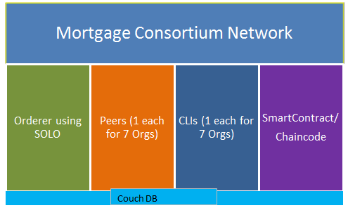
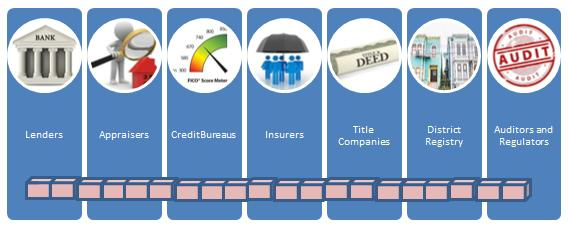
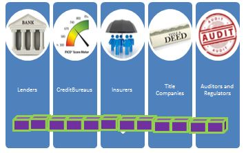
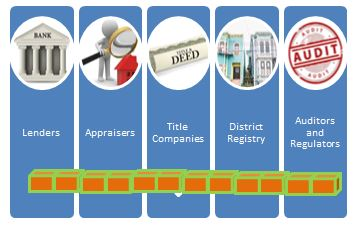
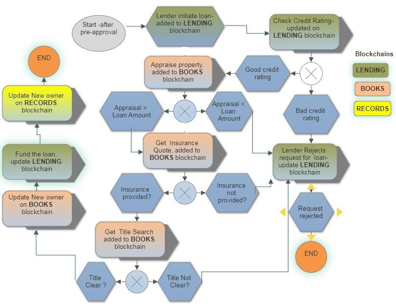

# Mortgage Processing with Blockchain and hyperledger Fabric

Mortgage industry has been around for a long time but has not improved the processing times for end to end mortgage application processing. This is due to the archaic technology and processes still followed by the parties involved in the mortgage food-chain. Currently it takes on an average of 40+ days from submitting home loan application to closing the loan or settlement of funds.

Blockchain mortgages has a potential to disrupt the existing processes and could eliminate costs and inefficiencies thus improving closing time line and saving a lot of fees that are currently charged in each step of application processing.

## Mortgage Consortium Setup
1. A peer for each organization
2. Pre-created Member Service Providers (MSP) for authentication and identification
3. An Orderer using SOLO
4. _Records channel_ – this channel is public blockchain which is owned by City/District for recording properties, details, ownership and title history for tax purposes. Everyone has read access to it but only Registry (City) can create update it.
5. _Lending Channel_ – is for lenders, credit bureaus, titel companies and Insurers to share information about prospective buyer. It is off limits to others for protecting sensitive information and data integrity. Lenders, Bureaus, and Insurers can update/add transactions, and auditors/regulators/title companies have read only access to it.
6. _Books or Appraiser-Title Channel_ is for appraisers and title companies to add/update transactions. Since these are third parties to lenders, and to resolve conflict of interests with lenders, lenders and registry have read access only- which it needs for processing loan.




Records Blockchain


Lending Blockchain


Books Blockchain


Access Control for channels


Flowchart and 3 blockchains



## Directory Structure
```

├── chaincode				        
      ├── mrtgexchg			
        ├── mrtgexchg.go		
├── cli.yaml
├── configtx.yaml
├── crypto-config.yaml
├── docker-compose-mrtgexchg.yaml
├── img/                    
├── peer.yaml
├── README.md
├── scripts
    ├──chaincodeInstallInstantiate.sh
    ├──cleanup.sh
    ├──createArtifacts.sh
    ├──checkOrgChannelsSubscription.sh
    ├──creatChannels.sh
    ├──createLedgerEntries.sh
    ├──createLoanRequest.sh
    ├──createLoanRequest-2.sh
    ├──createLoanRequest-3.sh    
    ├──joinChannels.sh
    ├──query.sh
    ├──queryAll.sh
    ├──setupNetwork.sh    
    ├──start_network.sh
    ├──stop_network.sh
```

## Features
Fabric allows for channel and accessControl to limit read and write access to blockchains. We have chaincode level as well as network level access controls.
1. chaincode level access control is implemented with
`creatorByte, _ := stub.GetCreator()` and then subsequently checking
`if c.producer(stub)` in invoke to allow instantiators of chaincode to create blocks. This can be further improved as Protobuf does not guarantee a deterministic serialisation.  The simplest solution is to use following packages:


    `import(
    "github.com/golang/protobuf/proto"
    "github.com/hyperledger/fabric/protos/msp"
    )`

And use them to deserialise the SignatureHeader then decode the certificate. The packages we need to import therefore are not included in the chaincode container. So, we have to "vendor" them. You can get the govendor tool  with go get -u github.com/kardianos/govendor e.g. in the chaincode container by using dev mode.

    `// Get serialised data
      serialised, _ := stub.GetCreator()

        // Use protobuf to deserialise data
          var id msp.SerializedIdentity
            proto.Unmarshal(serialised, &id)`


2. Network level is implemented with peer chaincode instantiate option to allow read and write access to orgs. For e.g., in the following, Bank can create new blocks on lending blockchain and Insurance, Fico orgs can update them, the rest of the orgs have readonly access on lending chanel.
`docker exec cli.Bank bash -c "peer chaincode instantiate -C lending -n lendingchaincode -v 0 -c '{\"Args\":[]}'  -P \"OR ('BankMSP.member', 'InsuranceMSP.member','FicoMSP.member')\""`

## Requirements
Please resolve all issues and get the first network up and running before attempting to install and run this demo. You can find ubuntu cheat sheet to get basic fabric running by following setting-up-fabric.pdf document included in this repo and could be found at the root of the folder structure. You can also take advantage of free courses from B9LabAcademy.com at [https://academy.b9lab.com]
Following are the software dependencies required to install and run hyperledger explorer
* docker 17.06.2-ce [https://www.docker.com/community-edition]
* docker-compose 1.14.0 [https://docs.docker.com/compose/]
* GO programming language 1.7.x
* git, curl, and other binaries needed to run on windows or OS X.
* Optionals - atom/vscode for editing files, kitematic for docker view.

## Clone Repository

Clone this repository to get the latest using the following command.
1. `https://github.com/Archstrategy/MortgageBlockchainFabric.git`
2. `rename top level folder to mrtgexchg` for some reason the network chokes without this name.
2. `cd mrtgexchg`  

## Setup network
* Run the following command to kill any stale or active containers:

  `./scripts/cleanup.sh`

* Create artifacts (certs, genesis block and channel info)

  `./scripts/createArtifacts.sh`

  * build chaincodes (compile before you deploy, this step is optional but is a must if you edit chaincodes and want to restart the network so as to make sure it does not fail to compile during deployment )

    `go get -u --tags nopkcs11 github.com/hyperledger/fabric/core/chaincode/shim`
    `go build --tags nopkcs11 `

* start network with start option
  `./scripts/start_network.sh`

* `./scripts/setupNetwork.sh` this script creates channels, join channels, instantiates and installs chaincode, populates ledger with initial entries (realestates on records, and realestates on books blockchains). It will also dump the entire ledgers at the end.

 You can  check if we have correct entries in all the ledgers.  Lending Ledger should be empty as we have not submitted any loan application.

`
Query Result: [{"Key":"11111", "Record":{"RealEstateID":"11111","Address":"10 High Strret, LA 75004 ","Value":1.1e+06,"Details":"6501 sq. ft 7 beds 2 baths blah blah","Owner":"Doug Gates",
##### this shows audit trail for each record added to the ledger
 *"TransactionHistory":{"createRealEstate":"Wed, 07 Feb 2018 02:04:50 UTC"}}}*

,{"Key":"12131415", "Record":{"RealEstateID":"12131415","Address":"12 High Strret, LA 75004 ","Value":3.5e+06,"Details":"6503 sq. ft 7 beds 2 baths blah blah","Owner":"Billy Bob ","TransactionHistory":{"createRealEstate":"Wed, 07 Feb 2018 02:05:20 UTC"}}}

]
2018-02-07 02:09:30.958 UTC [main] main -> INFO 003 Exiting.....`

#### this is for lending ledger(which is empty as no buyers yet...)

2018-02-07 02:09:51.211 UTC [main] main -> INFO 003 Exiting.....
Query Result: [
]
#### and books ledger
Query Result: [{"Key":"11111", "Record":{"RealEstateID":"11111","Appraisal":0,"NewTitleOwner":"","TransactionHistory":{"initiateBooks":"Wed, 07 Feb 2018 02:07:22 UTC"}}}

,{"Key":"12131415", "Record":{"RealEstateID":"12131415","Appraisal":0,"NewTitleOwner":"","TransactionHistory":{"initiateBooks":"Wed, 07 Feb 2018 02:07:53 UTC"}}}

,{"Key":"891011", "Record":{"RealEstateID":"891011","Appraisal":0,"NewTitleOwner":"","TransactionHistory":{"initiateBooks":"Wed, 07 Feb 2018 02:07:38 UTC"}}'  
`
##### Now run the  loan origination to watch how different actors call chaincode to process loan application.
You can submit 3 loan requests with 3 scripts. We have a requirement of title search for closing the loan that is randomized to produce true/false so there is 50/50 chance that your loan will be funded. Hence we try 3 loan requests to get at least one to go through with "funded" status.
You can also edit these sripts and global replace RealEstateID and new owner input by picking a different property from createLedgerEntries.sh file.

`./scripts/createLoanRequest.sh`
`./scripts/createLoanRequest-2.sh`
`./scripts/createLoanRequest-3.sh`

You can monitor Bank container which should output the outcome of loan status- "funded", Or "rejected" as shown below:

  `$^$^$^$^$^$^$^$^$^$^$^$^$^$^$^$^$ Trying to close mortgage loan
  FicoScore= 769.6071226805949 Fico Threshold= 650
  Insurance Quote= 4429.811036785886 Insurance Threshold= 0
  Loan Amount= 450000 Appraised value= 808260.2772959969
   Title Status= true
  $^$^$^$^$^$^$^$^$^$^$^$^$^$^$^$^$
  @@@@@@@@@@@@@@@@@@ LOan Funded @@@@@@@@@@@@@@@@@@@@@@`

  `$^$^$^$^$^$^$^$^$^$^$^$^$^$^$^$^$ Trying to close mortgage loan
 FicoScore= 746.867182473202 Fico Threshold= 650
 Insurance Quote= 4150.906754866397 Insurance Threshold= 0
 Loan Amount= 450000 Appraised value= 1.9166020083866343e+06
 Title Status= false
 $^$^$^$^$^$^$^$^$^$^$^$^$^$^$^$^$
--------------------- LOan Rejected------------------------`


### Test access control

1. Try to create a realestate record on records chain as a Bank -

  `docker exec cli.Bank bash -c "peer chaincode invoke -C records -n mrtgexchg -v 0 -c '{\"Args\":[\"createRealEstate\", \"9999\", \"995 High Strret, TX 795000 \",\"9250000\",\"49000 sq. ft 39 beds 2 baths blah blah\", \"Test` Fail\"]}'"

 Error: Error endorsing invoke: rpc error: code = Unknown desc = chaincode error (status: 500, message: No matching chain code function found-- create, initiate, close and record mortgage can only be invoked by chaincode instantiators which are Bank, Registry and Appraiser) - <nil> *

2. Try to create a records on books chain chain as a Bank

  `docker exec cli.Bank bash -c "peer chaincode invoke -C books -n mrtgexchg -v 0 -c '{\"Args\":[\"initiateBooks\", \"9999\"]}'"`

  Error: Error endorsing invoke: rpc error: code = Unknown desc = chaincode error (status: 500, message: No matching chain code function found-- create, initiate, close and record mortgage can only be invoked by chaincode instantiators which are Bank, Registry and Appraiser) - <nil>

### Next steps

1. Use vendor package for Protobuf deterministic serialization  as talked about in features section
2. Node.js frontend/UI
